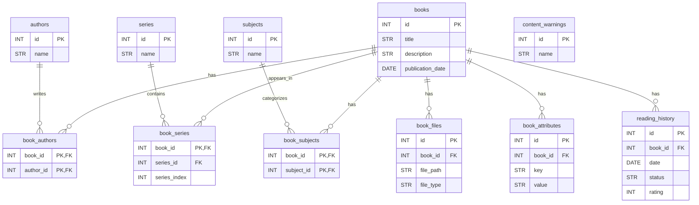

# 📚 eBook library system
> A Python-based eBook processing system with web interface


## 🐍 Prerequisites

**Python 3.8+** is required. Don't have Python? 

[](https://www.python.org/downloads/)

**eBook files** are required. Need files?

[](https://drive.google.com/drive/folders/18QA2cwgJoihB4ue88qip0UU6iXYSFYvu?usp=sharing) 

## ✨ Features

- 📖 **Catalog Management** - Organize your entire eBook collection
- 🔍 **Smart Search** - Find books by title, author, or genre
- 📊 **Series Tracking** - Keep track of book series and reading order
- 🎨 **Cover Wall** - Beautiful visual grid of all your book covers
- 🌐 **Web Interface** - Access your library from any device
- ⬇️ **Downloads** - Directly download to any device
- 📈 **Reading History** - Import reading activity and reviews

## 📁 Project Structure

```
Library/
├── 📂 infra/                     # All infrastructure necessary for system
│   ├── 📂 data/                  # eLibrary database and reading history data
│   │   ├── tt_db_ebook_lib.db     # !*ebook_processor.py will create this db file*!
│   │   └── reading_activity.csv   # !*your file of your historical reading activity*!
│   ├── 📂 templates/             # HTML templates for web interface
│   │   └── index.html             # Main library webpage template
│   ├── 📂 static/                # Static assets for web interface
│   │   ├── 📂 css/
│   │   │   └── style.css          # Stylesheet for webpage
│   │   └── 📂 js/
│   │       └── main.js            # JavaScript for webpage
│   ├── ebook_processor.py         # Builds database and ingests eBook metadata
│   ├── storygraph_processor.py    # Ingests reading history data
│   └── library_web_server.py      # Starts the eLibrary webpage
├── 📂 utils/                      # Utility scripts (dedupe folders, cover art grid, etc.)
│   ├── data_quality_tests.py      # Runs quality checks
│   ├── series_viewer.py           # Gets series data for viewing and for webpage to use
│   └── *_queries.sql              # Useful queries
├── 📂 debug/                      # Debugging / exploration scripts
└── 📂 lib/                        # eBook files and metadata (extract or place your library root here)
    └── 📂 Author/                 
        └── 📂 Book Title/
            ├── metadata.opf       # Metadata for python processor to read
            └── book.*             # Book file for downloads
```

---

## 🚀 Quick Start

```bash
# Install dependencies
py -m pip install flask
py -m pip install requests

# Build eBook catalog database
python ebook_processor.py

# (Optional) Import StoryGraph reading history
python storygraph_processor.py

# Start web server
python library_web_server.py
```

---

## 💡 Usage

### 1️⃣ Process Your Books

Builds the core eBook catalog (books, authors, series, metadata).

**Steps:**

1. [Download eBook library](https://drive.google.com/drive/folders/1aGTJdt27fEIrZqBuJBEksnyos8ODXsxp?usp=sharing) or locate your eBook files
2. Place the root folder in `infra`
3. Run:

```bash
python ebook_processor.py
```

### 2️⃣ Import Reading History

Imports your reading history and links it to existing books in the library.

**Steps:**

1. Export your data (.csv) from a reading tracking app (e.g. StoryGraph)
2. Place the .csv file in `infra` directory
3. Run:

```bash
python storygraph_processor.py
```
Data is stored in:



### 3️⃣ Browse Your Library

```bash
python library_web_server.py
```

Open: `http://localhost:5000`
> `http://YOUR_LOCAL_IP:5000` for others on same WiFi

### 4️⃣ View Cover Wall

```bash
python cover_wall_view.py
```

Open: `http://localhost:5000`
> `http://YOUR_LOCAL_IP:5000` for others on same WiFi

---

## 🧠 Data Model Notes

- eBook metadata is treated as the **source of truth** for books and authors
- StoryGraph data is imported as **reading history**, not book definitions
- Reading history optionally links to existing books via title/author matching
- If no match is found, reading history is still preserved

---

## 🛠️ Tech Stack

- **Backend:** Python, Flask, SQLite
- **Frontend:** HTML, CSS, JavaScript
- **Metadata:** OPF/XML, CSV

---

## 📝 License

MIT License

Copyright (c) 2025 Thomas Harrison

Permission is hereby granted, free of charge, to any person obtaining a copy of this software and associated documentation files (the "Software"), to deal in the Software without restriction, including without limitation the rights to use, copy, modify, merge, publish, distribute, sublicense, and/or sell copies of the Software, and to permit persons to whom the Software is furnished to do so, subject to the following conditions:

The above copyright notice and this permission notice shall be included in all copies or substantial portions of the Software.

THE SOFTWARE IS PROVIDED "AS IS", WITHOUT WARRANTY OF ANY KIND, EXPRESS OR IMPLIED, INCLUDING BUT NOT LIMITED TO THE WARRANTIES OF MERCHANTABILITY, FITNESS FOR A PARTICULAR PURPOSE AND NONINFRINGEMENT. IN NO EVENT SHALL THE AUTHORS OR COPYRIGHT HOLDERS BE LIABLE FOR ANY CLAIM, DAMAGES OR OTHER LIABILITY, WHETHER IN AN ACTION OF CONTRACT, TORT OR OTHERWISE, ARISING FROM, OUT OF OR IN CONNECTION WITH THE SOFTWARE OR THE USE OR OTHER DEALINGS IN THE SOFTWARE.
